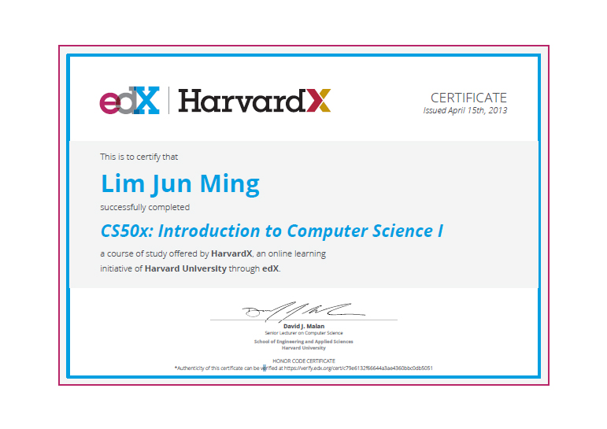

# CS50x Introduction to Computer Science

These are the problem sets I did as part of the CS50x MOOC.  
I have completed a previous run of this MOOC before in 2013. However, I might have already forgotten most of the C semantics due to disuse.  
No matter, I'll also be doing the harder "hacker editions" of the problem sets this time since I'm already familiar with programming in general.  

## MOOC Details
__Site:__ [edX](https://www.edx.org/course/introduction-computer-science-harvardx-cs50x)  
__Date:__ 2015  
__School:__ Harvard University  

## Certificate
  
_(This was from the previous run of the MOOC, which I also attended)_  

## Description
Each file contains a week's problem sets & are separated into normal `pset` and harder `hacker`.   
The purpose of each program is written directly into each file.  
Instructions for the problem sets are linked below.  

## Topics by Pset
`pset1` - Basic data manipulation  
`pset2` - Encryption & Ciphers  
`pset3` - Sort & Search (and a Breakout game)  
`pset4` - BMP Manipulation  
`pset5` - Hash Table & Linked Lists  
`pset6` - HTML protocol  
`pset7` - PHP, HTML & SQL  
`pset8` - JS, PHP, HTML & SQL  

## Libraries
 * [CS50 library](https://mirror.cs50.net/library50/c/cs50-library-c-3.0/) (used when getting any textual user input, and is required for most codes)  
 * [Stanford C++ library](http://stanford.edu/~stepp/cppdoc/) (only `gevents`, `gwindow` & `gobject`s for `breakout` in `pset3` & `hacker3`)  

## Links
 * [VM Instructions](https://manual.cs50.net/appliance/2014/#how_to_install_appliance)  
 * [Problem Set Instructions](http://cdn.cs50.net/2015/x/psets/) (navigate via week number -> normal/hacker ->  html/pdf)  
