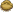
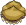

These are examples of a picture being scaled by resize.c  
The original image was taken from [Backyard Ninja Design](http://www.dumbmanex.com/bynd_freestuff.html)  
The pictures are listed below in ascending sizes.  

### 0.1x

### 0.2x

### 1.0x (Original)

 
### 3.0x

### 10.0x

